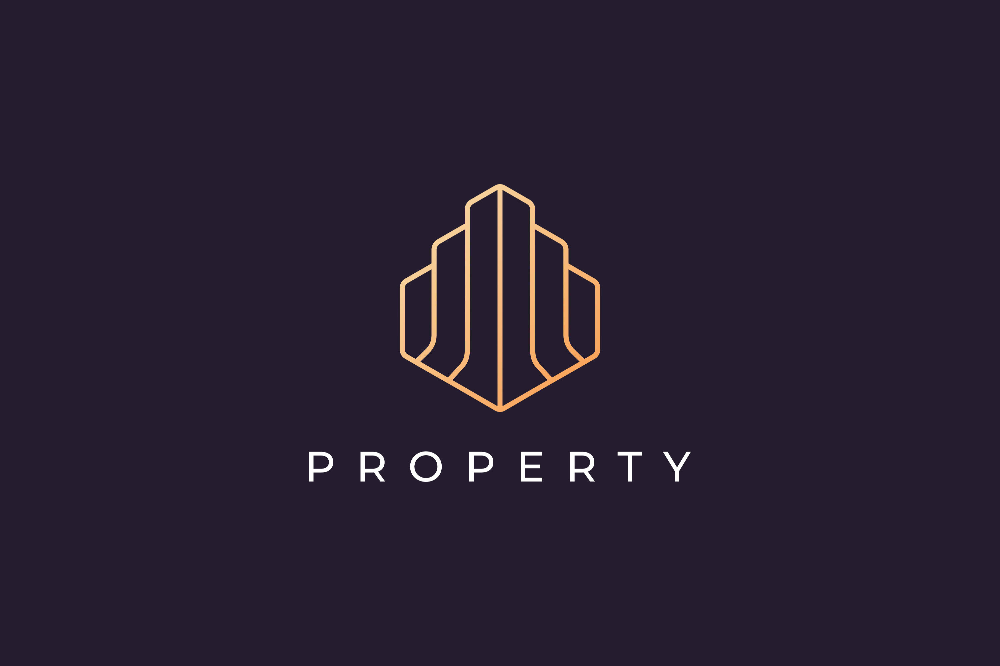

# dProp | Real-Time P2P Real Estate Proof of Concept powered by GenosDB

A decentralized, real-time real estate marketplace application built with HTML, TailwindCSS, and GenosDB in a single file. It demonstrates the power of Peer-to-Peer (P2P) architecture applied to property management, featuring granular access control, biometric authentication, and live state synchronization without a traditional backend.

 

## Features

  - **Real-time State Synchronization**: Property status changes (Available ➔ Reserved ➔ Sold) and content edits update instantly across all connected peers via GenosDB's reactive streams.
  - **Collaborative Ownership (ACLs)**:
      - **Share Access**: Owners can grant 'write' permissions to other users via their Ethereum address, enabling collaborative management of specific properties.
      - **Granular Permissions**: The UI automatically adapts to show edit controls only to owners and authorized collaborators.
  - **Advanced Identity & Security**:
      - **WebAuthn Integration**: Passwordless login using biometrics (fingerprint/FaceID) or security keys.
      - **Mnemonic Recovery**: BIP39-style recovery phrases for account restoration.
      - **RBAC & ACLs**: Robust security where data integrity is protected by cryptographic signatures and node-level access control lists.
  - **Full Lifecycle Management**:
      - **Atomic Editing**: Users can update property details (price, description, images) reusing the publishing form. Updates preserve the original creation date and ownership metadata.
  - **Interactive Map & Geolocation**:
      - Integration with **Leaflet** for visualizing properties on a map.
      - Real-time markers update dynamically as properties are added or filtered.
  - **Rich Filtering & Search**:
      - Filter by operation (Rent/Sale), property type, price range, and location.
      - Complex querying powered by GenosDB's query engine.
  - **Modern UI/UX with Dark Mode**:
      - **Dark Theme**: Fully integrated dark mode with persistence (localStorage) and auto-detection.
      - **Smart Map Styling**: Map tiles automatically dim and invert in dark mode for visual comfort.
      - **Reactive DOM Updates**: Surgical DOM manipulation for smooth UI transitions without full page reloads.

## Advantages of Using GenosDB (`gdb`) in Real Estate

  - **Built-in Security Manager (SM)**: Handles complex identity management and cryptographic signing out of the box, critical for property ownership verification.
  - **Access Control Lists (ACLs)**: The `db.sm.acls` module allows for node-level permissions. It supports `grant` and `revoke` operations, ensuring that write access is strictly restricted to the asset owner and explicitly authorized peers.
  - **Reactive `map()` Method**: Enables the application to listen for specific query changes (e.g., "Show me apartments under $200k") and update the UI in real-time as peers publish or modify listings.
  - **Schemaless & Flexible**: Easily stores diverse property data (JSON) including metadata, base64 images, and geolocation coordinates.
  - **Serverless Architecture**: The application runs entirely in the browser. GenosDB handles the data distribution and synchronization between peers, eliminating the need for a central API server for the core logic.

## Technologies Used

  - **HTML5**
  - **TailwindCSS** (via CDN for styling)
  - **Leaflet.js** (for Mapping)
  - **JavaScript** (ES2020+ modules)
  - **GenosDB (`gdb`)**:
      - **RTC Module**: For P2P networking.
      - **Security Manager**: For Auth & RBAC.
      - **ACLs Module**: For ownership enforcement and sharing.

## How to Use

1.  **Get the Code**:
      * Save the provided source code as a single `index.html` file.
2.  **Serve Locally (Required for WebAuthn)**:
      * **Important**: WebAuthn (biometric login) requires a Secure Context (HTTPS) or `localhost`.
      * Using Node.js:
        ```bash
        npx serve .
        ```
      * Or use the "Live Server" extension in VSCode.
3.  **Open in Browser**:
      * Navigate to `http://localhost:3000`.
4.  **Experience the Flow**:
      * **Register**: Create a Digital Identity and protect it with a Passkey.
      * **Publish**: Post a new property.
      * **Dark Mode**: Toggle the moon/sun icon in the navbar to switch themes.
      * **Collaborate**:
        1.  Open a second browser (Incognito). Log in as User B. Copy User B's address.
        2.  As Owner (User A), click the "Share" (User+) icon on your property. Paste User B's address.
        3.  User B will instantly see "Edit" and "Status" controls appear on that property.
      * **Real-time Edit**: Have User B change the price or status to "Sold". Watch it update instantly on User A's screen.

## Project Structure

  - `index.html`: This is a **single-file application**. It contains:
      - HTML Structure (Layout, Modals, Cards).
      - Tailwind Classes (Styling & Dark Mode config).
      - Application Logic (GenosDB initialization, Auth flow, ACL sharing logic, Map rendering, and Reactive listeners).

## Demo

[dProp Demo](https://estebanrfp.github.io/dProp/) Powered by [GenosDB (GDB)](https://github.com/estebanrfp/gdb)

## License

This is a Proof of Concept project. Feel free to use it for educational purposes or as a base for decentralized applications.

-----

#### Credits

[by Esteban Fuster Pozzi (estebanrfp)](https://github.com/estebanrfp)